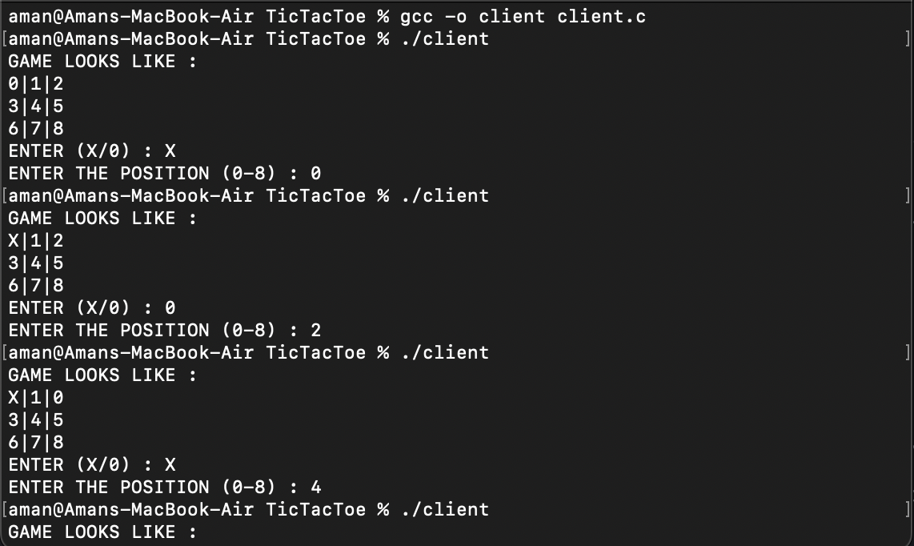

# TicTacToe
A TCP Client Server based Tic Tac Toe

## How to Run

### Server
```
gcc -o server server.c
./server
```
The Server Program will store all the progress

### Client

```
gcc -o client client.c
./client
```

#### Instructions

1. The Client Program will ask for the specific role of the player and the position.
2. The Client Program will be repeatedly run each time for an individual move.
